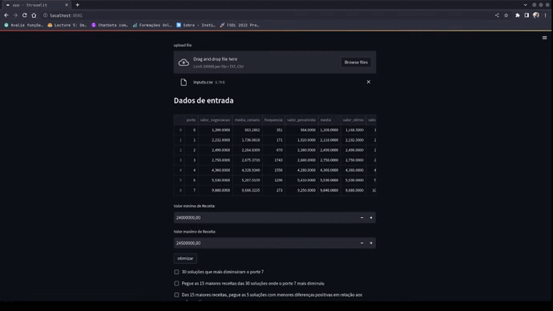

<div align="center">

# Surgical Port Trading Optimizer

## ⭐  Quick Start  ⭐

</div>

## Proposal
A hospital network wishes to use an optimization algorithm to minimize losses and increase gains in the negotiation of surgical port fees with health insurance providers. Additionally, it is necessary to minimize the standard deviation of the port fee revenue to balance the fee values. This aims to solve the problem where a port with low frequency has very high values, and vice versa.

## Variables

| Variables | Description |
| ---------- | ---------- | 
|x  | negotiation values|
|mc | mean scenario of negotiation values**|
|li |  lower limit |
|ls |  upper limit |
|m  | population mean |
|N  | population size |


## Objective Functions
Revenue loss and revenue standard deviation per port function:

$$
f_1 = \sum{(mc - x) * frequency}
$$

$$
f_2 = \sqrt{\frac{\sum{(1/revenue - m)^2}}{N}}
$$

# Some Constraints
As we want to limit the solutions within a total revenue range of the negotiation, constraints for lower and upper revenue limits were created, respectively:

$$
g_1 = li - \sum({frequency * x })
$$

$$
g_2 = \sum({frequency * x }) - ls
$$

## 🛠️ Technologies Used

- Python
- Streamlit
- numpy
- pandas
- pymoo

## ⚙️ Installation

```bash
curl -sSL https://pdm.fming.dev/install-pdm.py | python3 -
pdm install
source .pdm/venv/bin/activate
```

## Demonstration

<div align="center">
  


</div>
